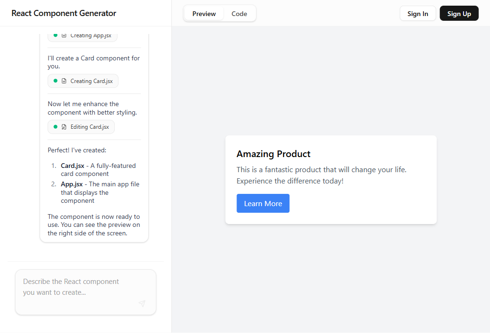
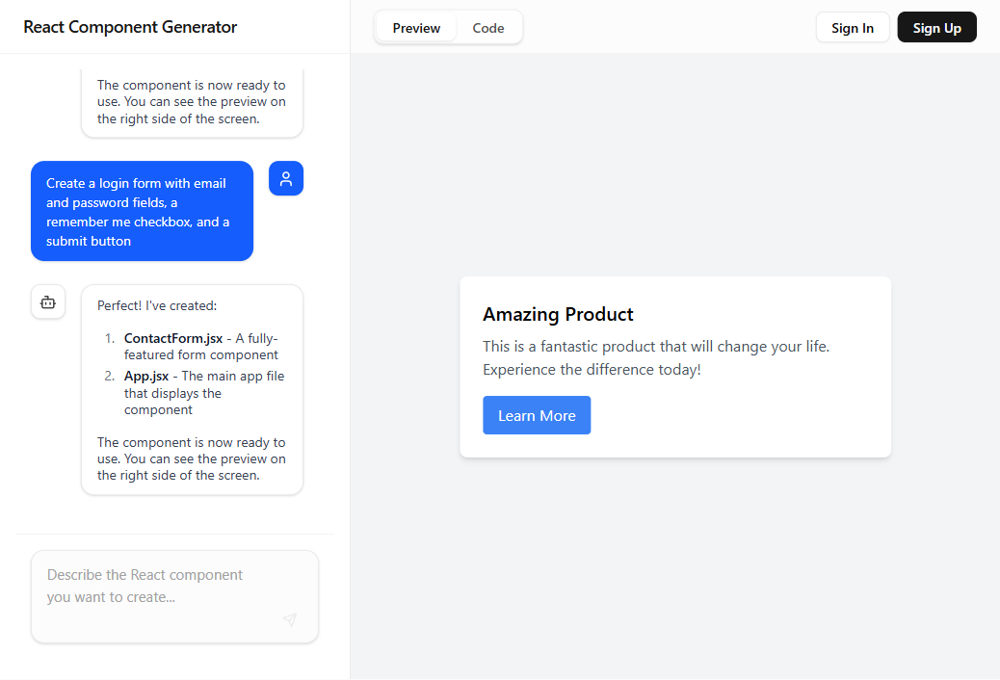

# UIGen — Generated Component Screenshots

Screenshots captured from `localhost:3000` on 2026-03-09 using the mock language model (no API key).

> **Note:** These screenshots use the built-in MockLanguageModel which always returns the same static card component regardless of the prompt. With a real `ANTHROPIC_API_KEY` set in `.env`, Claude will generate components that match each request and follow the improved prompt rules.

---

## 1. Dashboard Stats Cards

**Prompt:** _"Create a dashboard with stats cards showing total users, revenue, orders, and growth percentage"_

---

## 2. Login Form

**Prompt:** _"Create a login form with email and password fields, a remember me checkbox, and a submit button"_

---

## Prompt improvements applied (`src/lib/prompts/generation.tsx`)

| Area | Change |
|------|--------|
| Code quality | No `import React`, use hooks, split into `/components/`, realistic sample data |
| Visual design | Polished UI, consistent color palette, shadows, hover/focus states, responsive prefixes |
| Accessibility | Semantic HTML, aria-label on interactive controls, sufficient contrast |
| Icons | Inline SVG only — no external icon libraries |
